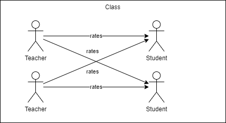
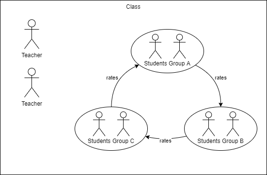

#  Verbal Feedback

Verbal Feedback allows structured feedback of student's presentations by one or several persons.

# Use cases
## Main use cases

## Teacher rating

1-n Teachers rate n students and teachers can access the rating of all students.

## Peer review

Students group A evaluates group B which evaluates group C.

## Installing via uploaded ZIP file ##

1. Log in to your Moodle site as an admin and go to _Site administration >
   Plugins > Install plugins_.
2. Upload the ZIP file with the plugin code. You should only be prompted to add
   extra details if your plugin type is not automatically detected.
3. Check the plugin validation report and finish the installation.

## Installing manually ##

The plugin can be also installed by putting the contents of this directory to

    {your/moodle/dirroot}/mod/verbalfeedback

**Note**: since Moodle 5.1 the installation folder is `{your/moodle/dirroot}/public/mod/verbalfeedback`.

Afterwards, log in to your Moodle site as an admin and go to _Site administration >
Notifications_ to complete the installation.

Alternatively, you can run

    $ php admin/cli/upgrade.php

to complete the installation from the command line.

## verbalfeedback
https://github.com/bfh/moodle-mod_verbalfeedback

## Version history

The versioning of this plugin follows roughly the pattern: X.Y-rZ where X.Y is
the latest suppored Moodle version and Z is an incresing number for newer versions
of the plugin whithin the same Moodle version.

### v5.1-r3

- Support course overview.

### v5.1-r2

- Fix [issue #52](https://github.com/bfh/moodle-mod_verbalfeedback/issues/52)
  French translation issue.
- Fix [issue #53](https://github.com/bfh/moodle-mod_verbalfeedback/issues/53)
  Problem with the display of questions.
- Adapt code to new codechecker rules that will come with Moodle 5.2.
- Remove compatibiliy of PHP < 8.1.14 in vendor dir and update 3rd party libraries.
- 3rd party lib Dallgoot/YAML: use @dev to get version 1.0.1 that fixes php 8.4 issues.

### v5.1-r1

- Support Moodle 5.1.
- Allow ratings without subcriteria.
- Remove backward compatibilty for PHP versions older 8.1.14.

### v5.0-r1

- Support PHP 8.4 and Moodle 5.0.

### v4.5-r3

- Fix [issue #46](https://github.com/bfh/moodle-mod_verbalfeedback/issues/46)
 non-Latin languages do not work in the PDF report
- Fix [issue #39](https://github.com/bfh/moodle-mod_verbalfeedback/issues/39)
  fix privacy provider. Thanks to [Nikolai](https://github.com/NJahreis) for a patch.

### v4.5-r2

- Fix [issue #47](https://github.com/bfh/moodle-mod_verbalfeedback/issues/47)
error when upgrading to 4.5 while using MySQL/MariaDB.

### v4.5-r1

- Major refactoring to circumvent memory issues with many instances.
- Adaptions in code for Moodle 4.5

### v4.4-r1

### v4.3-r1

- Support PHP 8.2 and Moodle 4.3.

### v4.1-r1

- Support PHP 8.1 and Moodle 4.1.

### v4.0-r2

-  Add Basque and Spanish to the default template (thanks to Iñigo Zendegi Urzelai)

### v1.0.1

### v1.0.0

- Initial release
