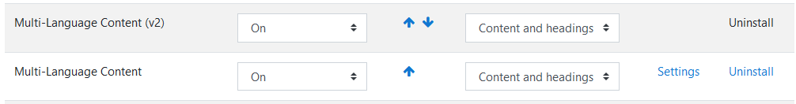
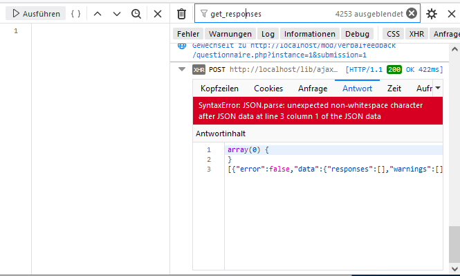

# Dokumentation: Verbalfeedback plugin

# Setup
0. docker-compose build
1. docker-compose up -d
2. docker cp ./moodle-mod_verbalfeedback/. verbalfeedback-bfh-moodle_moodle_1:/bitnami/moodle/mod/verbalfeedback/
3. In Container einloggen
   1. **UNSAFE!** ```chmod -R 777 /bitnami```
   2. ```cd /bitnami/moodle```
   3. ```npm install```
   4. ```cd /bitnami/moodle/mod/verbalfeedback```
   5. ```npm install```

4. Plugins "atto_multilang2" und "filter_multilang2" installieren.
5. Nach "Dashboard/Site administration/Plugins/Filters/Manage filters" navigieren und sicherstellen, das die Multi-Language Filter korrekt eingestellt sind: 
   

# Dateien in Container kopieren
```docker cp ./moodle-mod_verbalfeedback/. verbalfeedback-bfh-moodle_moodle_1:/bitnami/moodle/mod/verbalfeedback/```

# Dateien aus Container kopieren
```docker cp  verbalfeedback-bfh-moodle_moodle_1:/bitnami/moodle/mod/verbalfeedback/amd/build/. ./moodle-mod_verbalfeedback/amd/build/```

# Uglify JS-Dateien
Hinweis: Der Container muss gemäss Setup Schritt 3 vorbereitet sein.

1. In Container einloggen
2. ```cd /bitnami/moodle/mod/verbalfeedback```
3. ```grunt uglify```

**Fehler**

* ```Error: Cannot find module grunt-load-gruntfile'```
  * Lösung: `npm install` in `/bitnami/moodle/mod/verbalfeedback` wiederholen

## Debug Webservice API
Im Log/den Request nach dem Methodennamen filtern.


# Anwendungsfälle
## Hauptanwendungsfälle

## Teacher Bewertung


1-n Teacher bewerten n Studenten und Teacher können auf die Bewertung aller Studenten zugreifen. Hierauf liegt momentan der Hauptfokus.

## Peer review


Studenten Gruppe A bewertet Gruppe B welche Gruppe C bewertet.

### Implementationsvorschlag
Dozenten erstellen dazu drei Activities bspw. mit den Namen Gruppe A - B, Gruppe B - C, Gruppe C - A. Wàhrend die Studenten im Kurs weiterhin die Rolle Student behalten, können die Dozenten auf Activity ebene jeweils den Usern der Gruppe A, B oder C die Rolle 'Teacher'.

**Relevante Aspekte**
* Die integration von Roles and Permissions in Gruppen war wohl angedacht ([link](https://docs.moodle.org/dev/How_groups_work_in_Moodle), [link 2](https://docs.moodle.org/dev/Roles#Context)), scheint jedoch verworfen worden zu sein([link 1](https://docs.moodle.org/dev/Groups), [link 2](https://docs.moodle.org/dev/Groups_API)).

* Eine Alternative wäre die Rechteverwaltung durch das Plugin selbst vorzunehmen.

**Vorteile:**
* Die Rechteverwaltung ist "Moodle"-konform.
* Weitestgehend gleicher Code wie der Use-Case "Teacher Bewertung".
* Einfach umzusetzen

**Nachteile:**
* Umständlich für Dozenten
* Fraglich, ob dies in akzeptabler Weise im Gradebook integriert werden kann.


# Datenbank Modell

